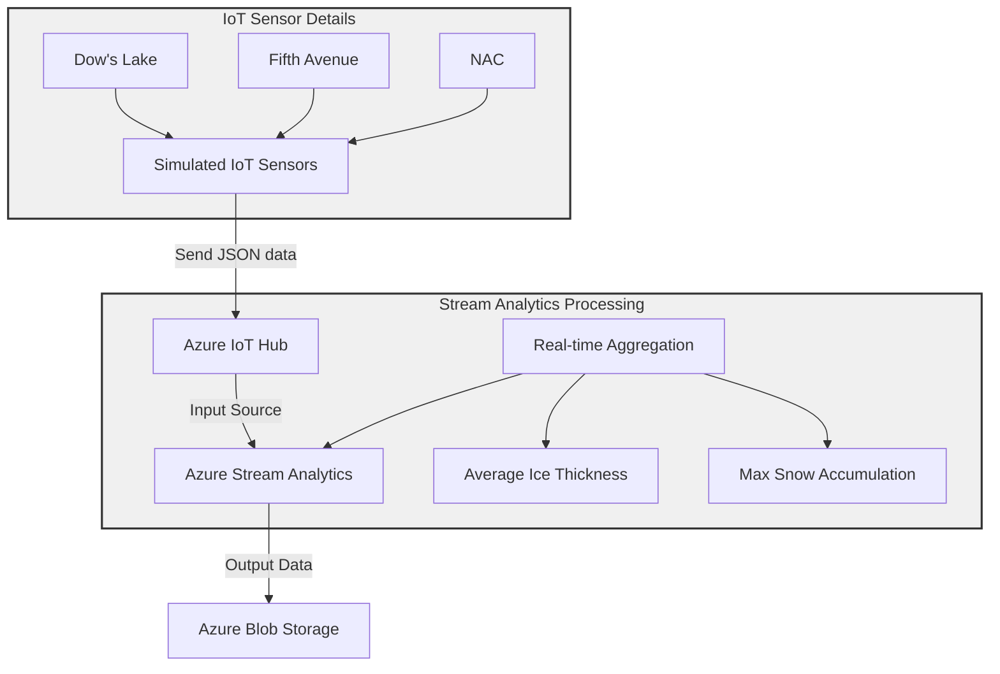

# Assignment-2
# Real-Time Monitoring System for Rideau Canal Skateway

## Introduction

The Rideau Canal Skateway, spanning 7.8 kilometers through the heart of Ottawa, is not just a recreational facility but a crucial part of the city's winter identity. As the world's largest naturally frozen skating rink, it faces unique challenges in maintaining safe skating conditions for thousands of daily visitors. This project presents a **Real-Time Monitoring System** that uses simulated IoT sensors, processes the collected data in real-time, and stores it for analysis. By analyzing metrics like ice thickness and weather conditions, the system helps detect unsafe conditions, enhancing visitor safety.

The system's importance becomes particularly evident during fluctuating winter temperatures, when rapid changes in weather conditions can affect ice stability. By continuously monitoring key metrics at three strategic locations, the system provides essential data that helps maintenance crews and public safety officials make informed decisions about skateway operations.

---

## Table of Contents

- [System Overview](#system-overview)
- [Features](#features)
- [Technologies Used](#technologies-used)
- [Installation](#installation)
- [Usage](#usage)
- [System Architecture](#system-architecture)
- [Step-by-Step Implementation](#step-by-step-implementation)
  - [Simulating IoT Sensors](#1-simulating-iot-sensors)
  - [Setting up Azure IoT Hub](#2-setting-up-azure-iot-hub)
  - [Configuring Azure Stream Analytics](#3-configuring-azure-stream-analytics)
  - [Azure Blob Storage Setup](#4-azure-blob-storage-setup)
- [Example Outputs](#example-outputs)
- [Results](#results)

## System Overview



The three monitoring locations along the Rideau Canal Skateway were carefully selected to provide comprehensive coverage of this historic waterway. Each location serves a specific purpose in the monitoring network:

At the southern end, the Dow's Lake monitoring station plays a crucial role in understanding ice formation patterns where the canal widens into the lake. This location experiences unique environmental conditions due to its exposure to wind and larger water body effects, making it an essential point for early detection of changing ice conditions.

The Fifth Avenue location serves as a central monitoring point, representing typical urban canal conditions where the waterway is flanked by city infrastructure. This section of the canal typically experiences consistent skating conditions and serves as a baseline for comparing conditions throughout the system. Its central position makes it particularly valuable for maintenance crews who can quickly respond to any detected issues.

At the northern end, the National Arts Centre (NAC) location monitors one of the most heavily trafficked sections of the skateway. This area presents unique challenges due to urban heat island effects from surrounding buildings and infrastructure. The proximity to downtown Ottawa means this section often experiences different temperature patterns compared to other parts of the canal, making continuous monitoring particularly important for public safety.

Key components:
- **Simulated Sensors** generate ice and weather data every 10 seconds.
- **Azure IoT Hub** collects and routes sensor data.
- **Azure Stream Analytics** processes the data for actionable insights.
- **Azure Blob Storage** organizes and stores processed data.

## Features

The real-time monitoring system's features were developed with a clear focus on operational efficiency and public safety. The 10-second data generation interval was chosen after careful consideration of several factors. This frequency provides maintenance teams with near-immediate awareness of changing conditions while avoiding system overflow from excessive data generation. When conditions begin to deteriorate, this rapid update cycle ensures that safety teams can respond proactively rather than reactively.

The multi-location coverage system creates a comprehensive monitoring network that accounts for the varying environmental conditions along the skateway. Each location experiences different external factors that affect ice conditions. Dow's Lake's open exposure creates different ice formation patterns compared to the sheltered urban sections near the NAC. By monitoring all three locations simultaneously, the system provides maintenance teams with a complete picture of skateway conditions, enabling them to allocate resources effectively.

The system includes:
- Real-time monitoring of ice thickness, snow accumulation, and temperatures.
- Simulates three distinct locations with unique data streams.
- Automated processing and storage of sensor data for analysis.
- Organized data storage in Azure Blob Storage.

## Technologies Used

The technology stack for this project was carefully selected to ensure robust operation and seamless integration:

- **Python** serves as the foundation for the sensor simulation system, chosen for its extensive IoT libraries and strong support for Azure cloud services. The implementation leverages Python's capabilities for handling JSON data structures and its efficient random number generation for creating realistic sensor readings.

- **Azure IoT Hub** acts as the central nervous system of the entire monitoring setup. It manages not only the basic task of collecting sensor data but also handles crucial aspects like device identity management and secure communication. The hub's message routing capabilities ensure that data flows efficiently from sensors to the analytics pipeline without manual intervention.

- **Stream Analytics** provides the real-time processing capability that transforms raw sensor data into actionable insights. The service's native integration with both IoT Hub and Blob Storage creates a seamless data pipeline. The 5-minute processing window was selected to provide meaningful trend analysis while maintaining system responsiveness.

- **Azure Blob Storage** provides reliable and cost-effective storage of processed data, organized hierarchically for efficient access and analysis.

## Installation

### Prerequisites

- [Azure Account](https://azure.microsoft.com/)
- Python 3.x installed on your local machine.
- Required Python libraries:
  ```bash
  pip install azure-iot-device
  ```

## Usage

### Simulating Sensors

1. Add your **Primary Connection String** from Azure IoT Hub to the Python script.
2. Run the simulation script:
   ```bash
   python sensor.py
   ```

## System Architecture

The data journey through the system begins with the sensor simulation generating readings every 10 seconds. Each data point includes crucial measurements of ice thickness, surface temperature, snow accumulation, and external temperature. These parameters were chosen based on their direct impact on skating conditions and safety considerations.

The system operates in four key stages:

1. **Data Generation**: Sensors generate JSON data every 10 seconds.
2. **Data Collection**: Data is sent to Azure IoT Hub.
3. **Real-Time Processing**: Azure Stream Analytics calculates metrics like average ice thickness and maximum snow accumulation.
4. **Data Storage**: Processed data is saved in JSON format in Azure Blob Storage.

## Step-by-Step Implementation

### 1. Simulating IoT Sensors

Sensors generate data in the following format:

```python
import json
import random
import time
from azure.iot.device import IoTHubDeviceClient

# Replace with your IoT Device Connection String
CONNECTION_STRING = "Connection String"

def generate_sensor_data(location):
    """Generate random sensor data."""
    return {
        "location": location,
        "iceThickness": random.randint(15, 30),  # cm
        "surfaceTemperature": random.uniform(-5, 5),  # °C
        "snowAccumulation": random.randint(0, 20),  # cm
        "externalTemperature": random.uniform(-10, 5),  # °C
        "timestamp": time.strftime("%Y-%m-%dT%H:%M:%SZ", time.gmtime())
    }

def send_data(client, location):
    """Send data to IoT Hub."""
    while True:
        data = generate_sensor_data(location)
        client.send_message(json.dumps(data))
        print(f"Sent data: {data}")
        time.sleep(20)  # Send data every 20 seconds

if __name__ == "__main__":
    client = IoTHubDeviceClient.create_from_connection_string(CONNECTION_STRING)
    location = "Fifth Ave"  # Change for each device
    send_data(client, location)
```
#### How to Run

1. Install the required Python library:
   ```bash
   pip install azure-iot-device
``
2. Add the **Primary Connection String** from the IoT Hub to the script.
3. Run the script:
   ```bash
   python IoTSensorSimulation.py
```
### 2. Setting up Azure IoT Hub

1. Create an **IoT Hub** in the Azure portal.
2. Add devices for each location:
   - Dow's Lake
   - Fifth Avenue
   - NAC
3. Copy the **Primary Connection String** for each device.
4. Enable message routing to **Azure Stream Analytics**.

```yaml
# Example YAML configuration for IoT Hub routing
IoTHub:
  devices:
    - name: "Dow's Lake"
      connectionString: "PrimaryConnectionStringForDowLake"
    - name: "Fifth Avenue"
      connectionString: "PrimaryConnectionStringForFifthAve"
    - name: "NAC"
      connectionString: "PrimaryConnectionStringForNAC"
  messageRouting: "Enabled"
```
### 3. Configuring Azure Stream Analytics

1. Create a **Stream Analytics Job** in the Azure portal.
2. Add:
   - **Input**: Azure IoT Hub.
   - **Output**: Azure Blob Storage.
3. Use the following SQL query to process the data:
   ```sql
   SELECT  
       System.Timestamp AS windowEndTime,  
       location,  
       AVG(iceThickness) AS avgIceThickness,  
       MAX(snowAccumulation) AS maxSnowAccumulation  
   FROM  
       IoTHubInput  
   GROUP BY  
       TumblingWindow(minute, 5), location
``
### 4. Azure Blob Storage Setup

1. Create a **Blob Storage** container.
2. Organize files by date and time:

#### Example Processed Data File

```json
{  
  "windowEndTime": "2024-11-23T12:05:00Z",  
  "location": "Dow's Lake",  
  "avgIceThickness": 26.5,  
  "maxSnowAccumulation": 9  
}
```
---

## Example Outputs

### Raw Sensor Data
```json
{  
  "location": "Fifth Avenue",  
  "iceThickness": 28,  
  "surfaceTemperature": -2,  
  "snowAccumulation": 5,  
  "externalTemperature": -6,  
  "timestamp": "2024-11-23T12:00:00Z"  
}
```

### Processed Data (Stored in Blob Storage)
```json
{
  {"location":"Dow's Lake","avgIceThickness":21.166666666666668,"maxSnowAccumulation":19.0,"aggregationTimestamp":"2024-11-30T08:10:00.0000000Z"}
  {"location":"NAC","avgIceThickness":21.333333333333332,"maxSnowAccumulation":20.0,"aggregationTimestamp":"2024-11-30T08:10:00.0000000Z"}
  {"location":"Fifth Ave","avgIceThickness":21.266666666666666,"maxSnowAccumulation":19.0,"aggregationTimestamp":"2024-11-30T08:10:00.0000000Z"}
}
```

## Results

The real-world impact of this monitoring system is demonstrated through its continuous generation of actionable insights. By processing data every 5 minutes, the system strikes an optimal balance between providing timely information and avoiding information overload for operators. The average calculations help identify trending conditions, while maximum values for measurements like snow accumulation alert maintenance teams to potential issues requiring immediate attention.

The system's organized data storage approach has proven valuable for both immediate operational needs and long-term planning. Maintenance teams can quickly access current conditions for any location, while planners can analyze historical data to identify patterns and optimize resource allocation. This dual functionality makes the system not just a monitoring tool but a comprehensive resource for skateway management.

Real-time processing calculates average ice thickness and maximum snow accumulation every 5 minutes for each location. Processed data is stored in Azure Blob Storage in an organized structure, allowing easy retrieval and analysis for both immediate operational needs and long-term planning purposes.